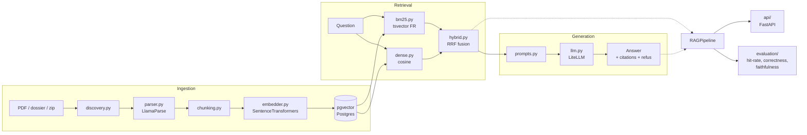

# RIP-Agent

RAG agentique sur des documents de concession télécom publique (DSP/RIP), pensé eval-first et contrôlé en CI.

**Périmètre actuel (Phase 1)** : baseline RAG la plus simple possible — ingestion → retrieval hybride (BM25 + dense) → génération avec citations → harnais d'évaluation — avec une architecture qui laisse la place à un agent, des guardrails et du multi-modèle plus tard, sans les implémenter maintenant.

## Architecture



`RAGPipeline.answer(question)` est le point d'entrée unique, réutilisé à l'identique par l'API et par le harnais d'évaluation : l'éval mesure exactement ce que l'API sert.

Chaque étage (`ingestion`, `retrieval`, `generation`, `evaluation`) émet ses propres spans OpenTelemetry — pas une instrumentation ajoutée après coup.

## Stack

- **Python 3.12** + **uv** pour la gestion de dépendances/env
- **FastAPI** (async) pour l'API
- **Pydantic v2** pour tous les contrats (schemas/)
- **PostgreSQL + pgvector** pour le stockage vectoriel et le retrieval lexical (tsvector français)
- **LlamaParse** pour le parsing PDF
- **SentenceTransformers** pour les embeddings
- **LiteLLM** comme couche d'abstraction LLM (un seul modèle pour l'instant, prêt pour du routing multi-modèle)
- **OpenTelemetry** pour les spans, dès le départ
- **pytest** + **GitHub Actions** pour les tests et la CI
- **Docker / docker-compose** pour l'environnement local (API + pgvector)

## Démarrer en local

```bash
cp .env.example .env          # renseigner les clés API (LlamaParse, Anthropic...)
docker compose up -d db       # lève uniquement pgvector
uv sync --extra dev

uv run python scripts/run_ingestion.py --source sample_corpus/docs/
uv run python scripts/run_eval.py --eval-set eval/cases.jsonl   # jeu de cas à fournir
uv run uvicorn rip_agent.api.main:app --reload
```

Ou tout en conteneur :

```bash
docker compose up --build
```

## Tests

```bash
uv sync --extra dev
uv run ruff check .
uv run mypy src
uv run pytest
```

Tous les tests unitaires tournent sans Postgres/LlamaParse/SentenceTransformers/LiteLLM réels : chaque collaborateur externe est injecté (DI) avec un défaut lazy-importé, donc remplaçable par un faux dans les tests.

## Structure

```
src/rip_agent/
  config.py          Settings (pydantic-settings)
  telemetry.py        setup_telemetry / get_tracer
  schemas/             Contrats Pydantic (Document, Chunk, Answer, EvalCase...)
  ingestion/           discovery -> parser -> chunking -> embedder -> store
  retrieval/           bm25, dense, hybrid (RRF), pipeline
  generation/          llm (LiteLLM), prompts, pipeline
  rag/                 RAGPipeline = retrieval + generation
  evaluation/          loader, judge, metrics/, runner
  api/                 FastAPI (main, routes, deps)
scripts/               CLI : run_ingestion.py, run_eval.py
sample_corpus/         Corpus public fictif (clonable, sans données réelles)
```

`data/` (corpus réel) est gitignored — seul `sample_corpus/` (fictif) est versionné.

## Baseline d'évaluation

_À renseigner après le premier run d'éval sur un jeu de cas réel._

| Métrique     | Score |
|--------------|-------|
| Hit rate     | TBD   |
| Correctness  | TBD   |
| Faithfulness | TBD   |
