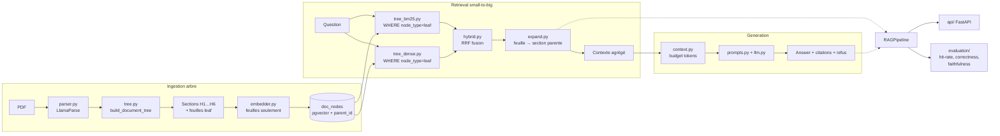
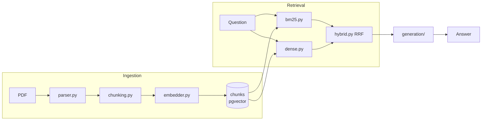

# RIP-Agent

RAG agentique sur des documents de concession télécom publique (DSP/RIP), pensé eval-first et contrôlé en CI.

Deux modes de retrieval coexistent : **flat** (Phase 1, table `chunks`) et **hiérarchique** (Phase 2, table `doc_nodes`). Le mode actif se choisit via `USE_TREE_RETRIEVAL=true` dans `.env` ou `--tree` en CLI.

## Architecture — Retrieval hiérarchique (Phase 2)



**Pattern small-to-big** : la recherche porte sur les feuilles (chunks fins, meilleur recall), le contexte fourni à la génération est le texte agrégé de la section parente (plus riche). Les sections H1 contiennent l'intégralité du texte de leurs descendants.

## Architecture — Retrieval plat (Phase 1)



`RAGPipeline.answer(question)` est le point d'entrée unique, réutilisé à l'identique par l'API et par le harnais d'évaluation : l'éval mesure exactement ce que l'API sert.

Chaque étage émet ses propres spans OpenTelemetry. Le découpage et la composition du contexte utilisent un vrai compteur de tokens (`tiktoken`, `tokenization.py`).

## Stack

- **Python 3.12** + **uv** pour la gestion de dépendances/env
- **FastAPI** (async) pour l'API
- **Pydantic v2** pour tous les contrats (schemas/)
- **PostgreSQL + pgvector** pour le stockage vectoriel et le retrieval lexical (tsvector français)
- **LlamaParse** pour le parsing PDF
- **SentenceTransformers** pour les embeddings
- **LiteLLM** comme couche d'abstraction LLM (un seul modèle pour l'instant, prêt pour du routing multi-modèle)
- **OpenTelemetry** pour les spans, dès le départ
- **pytest** + **GitHub Actions** pour les tests et la CI
- **Docker / docker-compose** pour l'environnement local (API + pgvector)

## Démarrer en local

```bash
cp .env.example .env          # renseigner LLAMAPARSE_API_KEY, OPENAI_API_KEY…
docker compose up -d db       # lève uniquement pgvector
uv sync --extra dev

# Mode flat (Phase 1)
uv run python scripts/run_ingestion.py --source sample_corpus/docs/
uv run python scripts/run_eval.py --eval-set eval/cases.jsonl

# Mode hiérarchique (Phase 2) — USE_TREE_RETRIEVAL=true dans .env pour l'API
uv run python scripts/run_tree_ingestion.py --source sample_corpus/docs/
uv run python scripts/run_eval.py --eval-set eval/cases.jsonl --tree

uv run uvicorn rip_agent.api.main:app --reload
```

Ou tout en conteneur :

```bash
docker compose up --build
```

### UI de démo (jetable)

```bash
uv sync --extra ui
uv run streamlit run streamlit_app/app.py
```

### Frontend (`web/`)

Vitrine portfolio : une page "Ask BidAgent" au look du design system Claude Design (dark, aurora orange/bleu), branchée sur `POST /query`. Coexiste avec l'UI Streamlit ci-dessus, qui reste l'outil de debug interne — `web/` est la démo présentable.

```bash
cd web
npm install
cp .env.example .env   # VITE_API_URL, par défaut http://localhost:8000
npm run dev
```

L'API doit tourner en local (`uv run uvicorn rip_agent.api.main:app --reload`) ; le CORS est ouvert pour `http://localhost:5173` (serveur Vite par défaut) dans `api/main.py`.

## Tests

```bash
uv sync --extra dev
uv run ruff check .
uv run mypy src
uv run pytest
```

Tous les tests unitaires tournent sans Postgres/LlamaParse/SentenceTransformers/LiteLLM réels : chaque collaborateur externe est injecté (DI) avec un défaut lazy-importé, donc remplaçable par un faux dans les tests.

## Structure

```
src/rip_agent/
  config.py              Settings (pydantic-settings) — use_tree_retrieval: bool
  telemetry.py           setup_telemetry / get_tracer
  schemas/
    document.py          Document, Chunk, DocumentNode, IngestReport
    retrieval.py         RetrievalQuery, RetrievedChunk
    generation.py        Answer, Citation
    evaluation.py        EvalCase, EvalResult, EvalReport
  ingestion/
    discovery.py         PDF / dossier / zip → liste de chemins
    parser.py            LlamaParse → Document
    chunking.py          Découpage plat (Phase 1)
    tree.py              build_document_tree — arbre H1…H6 + feuilles (Phase 2)
    embedder.py          SentenceTransformers
    store.py             PgVectorStore — table chunks (Phase 1)
    node_store.py        NodeStore — table doc_nodes + parent_id FK (Phase 2)
    pipeline.py          IngestPipeline (Phase 1)
    tree_pipeline.py     TreeIngestPipeline (Phase 2)
  retrieval/
    _shared.py           chunk_from_row, RetrievalPipelineProtocol
    bm25.py              Recherche lexicale sur chunks (Phase 1)
    dense.py             Recherche cosine sur chunks (Phase 1)
    tree_bm25.py         Recherche lexicale sur doc_nodes feuilles (Phase 2)
    tree_dense.py        Recherche cosine sur doc_nodes feuilles (Phase 2)
    hybrid.py            RRF fusion (partagé Phase 1 & 2)
    expand.py            fetch_parents + expand_to_parent (Phase 2)
    pipeline.py          RetrievalPipeline (Phase 1)
    tree_pipeline.py     TreeRetrievalPipeline (Phase 2)
  generation/            context, llm, prompts, pipeline
  rag/                   RAGPipeline — accepte RetrievalPipelineProtocol
  evaluation/            loader, judge, metrics/, runner
  api/                   FastAPI — deps.py switche sur tree via USE_TREE_RETRIEVAL
scripts/
  run_ingestion.py       Phase 1
  run_tree_ingestion.py  Phase 2
  run_eval.py            Eval Phase 1 ou --tree pour Phase 2
streamlit_app/           UI de démo jetable (branchée sur RAGPipeline)
web/                     Frontend React (vitrine portfolio, branché sur l'API)
sample_corpus/           Corpus public fictif (clonable, sans données réelles)
```

`data/` (corpus réel) est gitignored — seul `sample_corpus/` (fictif) est versionné.

## Baseline d'évaluation

_À renseigner après le premier run d'éval sur un jeu de cas réel._

| Métrique     | Score |
|--------------|-------|
| Hit rate     | TBD   |
| Correctness  | TBD   |
| Faithfulness | TBD   |
